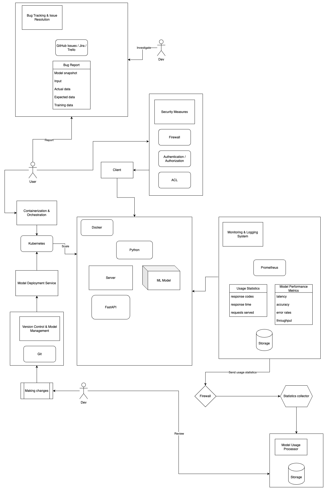

# Machine Learning app for recommendation / classification using Python / FastAPI / Docker (client-server)



## Overview
This ML predict project centers around deploying and providing API for machine learning models. 

There are three parts:
1) We start with a ML model that needs to be built into a service. 
2) Then we are going to pack and deploy this service. 
3) Finally, we are goint to to design an architecture for deploying this model into a customer's infrastructure.

We will use a ML model that we consider to be a geometry encoder whose outputs inform a recommendation system for generative engineering design.

The recommendations would be served to the user via a web app.

## Part 1: Model serving
We will take a pretrained model and prepare it for serving. We are going to use web server framework like FastAPI.

The following files relevant for this part:
- A requirements.txt
- A client.py which, when run, will ping the model server with an example input and print the result of a correctness test (pass or fail)
- A skeleton server.py which contains functions to load the model and make a prediction
- A model.pkl which contains the pretrained model

Running server.py to bring up the server should produce no errors, and then running client.py should output a success message. 

## Part 2: Package and build
We want to deploy this model to multiple environments by packaging it as a Docker container.

The provided repo contains these files for this part of the project:
- Dockerfile
- build.sh
- deploy.sh

The following things should work:
- Running build.sh should execute the container build step
- Running deploy.sh should bring up the container as a server like in the last section
- As before, running client.py should ping the container from outside and produce a success message

## Part 3: System architecture and deployment
Now, imagine you want to deploy this model to a customer. The customer requires this to be on their infrastructure behind a firewall. We’d like to get information about the model's performance back to our systems for monitoring operations and improving the model.

A few things to focus on:
- What are the most important design considerations and open questions to guide decision making?
- What general system architecture would you employ here? Defend your choices and discuss tradeoffs.
- What technology supports the proposed architecture?
- What is the operational story? Consider a bug reported by the customer: what is the process for understanding, fixing, and redeploying?

We are not going to be super detailed on everything because you can imagine that you're in week 1 of this project, we just want to demostrate how to approach this type of problem from a clean sheet.

## How to run a ML-Predict Server?
### Without Docker
```
python -m pip install fastapi==0.110.1
python -m pip install "uvicorn[standard]"==0.29.0

python -m pip install scikit-learn==1.4.1.post1
python -m pip install requests==2.31.0

cd ML-Predict
cd src 
uvicorn server:app
```
### Using Docker
```
cd ML-Predict
docker build -t my_ml_predcit_image .
docker run -d --name my_ml_container -p 8000:8000 my_ml_predcit_image
```

### Using Docker and pre-defined bash scripts
```
cd ML-Predict
bash ./build.sh
bash ./deploy.sh
```

## How to test ML Server and ML Model?
```python client.py```

## Architecture Goals & Design Considerations
The primary goals of the architecture are:
- Deploying an ML model using Python and FastAPI.
- Hosting the system behind a customer's firewall for security and compliance reasons.
- Monitoring model performance and operations for continuous improvement.

Design considerations include:
- Scalability to handle varying levels of incoming requests.
- Modularity to allow easy integration of additional components or updates.
- Cost implications of deploying and maintaining the infrastructure. Optimize resource usage and consider cost-effective alternatives where possible.
- Security measures to ensure data protection within the customer's infrastructure.

## Trade-offs and Considerations

- **Scalability vs. Performance**: How to balance the need for scalability with optimal model performance under varying loads?
- **Complexity vs. Flexibility:** The chosen architecture may introduce complexity, especially in managing networking infrastructure and security measures. However, this complexity is necessary to ensure flexibility and customization to meet the customer's specific requirements.
- **Performance vs. Security:** Implementing stringent security measures (e.g., encryption, authentication) may introduce overhead and impact performance. Striking the right balance between security and performance is crucial.
- **Cost vs. Scalability:** Certain components (e.g., VPNs, load balancers) may incur additional costs. Balancing cost considerations with scalability requirements is essential to ensure cost-effectiveness without compromising system performance.
- **Operational Overhead:** Managing and maintaining the deployed system, especially in a customer's infrastructure, may require additional operational overhead. Automating deployment, monitoring, and maintenance processes can mitigate this overhead.
- **Customer Requirements:** Aligning the system architecture with the customer's requirements is paramount. Iterative discussions and collaboration with the customer are necessary to ensure that the architecture meets their specific needs and constraints.
- **Security Measures**: What specific security measures should be implemented to ensure data protection within the customer's infrastructure?
- **Monitoring Strategy**: Which metrics are critical for monitoring model performance, and how should they be tracked and analyzed?
- **Containerization Strategy**: What are the implications of containerizing the application with Docker in terms of deployment and resource utilization?

## Architecture
### Assumptions
- The customer's infrastructure supports Docker containers for deployment.
- Monitoring and logging tools are available for performance tracking.
- The customer has a network infrastructure that allows inbound traffic to reach the deployed system, collect and send statistics back to our system.

### Model Serving Layer:

- **Description:** This layer is responsible for serving predictions generated by the ML model.
- **Components:** It typically includes a web server or an API endpoint that exposes the model's inference capabilities.
- **Rationale:** By separating the model serving layer from other components, we can ensure scalability and fault isolation. It allows the model to be accessed by multiple clients without exposing the underlying infrastructure.

### Model Execution Environment:

- **Description:** This component hosts the ML model and its dependencies.
- **Components:** It may consist of containers (e.g., Docker) or virtual machines (e.g., AWS EC2 instances) configured to run the model.
- **Rationale:** By encapsulating the model within a container or virtual machine, we ensure consistent behavior across different environments. It also simplifies deployment and dependency management.

### Networking Infrastructure:

- **Description:** This component provides network connectivity between the model serving layer, the execution environment, and external systems.
- **Components:** It may include VPNs, firewalls, routers, and load balancers.
- **Rationale:** Ensuring secure communication between components behind the customer's firewall is critical. VPNs can establish a secure tunnel, while firewalls and routers can enforce access controls and traffic filtering.

### Components
1. **FastAPI Application**: Responsible for exposing endpoints to interact with the ML model. Handles incoming HTTP requests and orchestrates model inference.

2. **Machine Learning Model**: The core component responsible for making predictions based on input data.

3. **Docker Containerization**: The system will be containerized using Docker to ensure consistency across environments and easy deployment.

4. **Monitoring & Logging**: Integration with monitoring tools (e.g., Prometheus, Grafana) to collect metrics and track system performance. Logging mechanisms for capturing errors, warnings, and operational events.

5. **Security Layer**: Implementation of security measures such as encryption, authentication, and access controls to safeguard data and restrict unauthorized access.

### Technology
- **Python**: For developing the FastAPI application and ML model.
- **FastAPI**: As the web framework for building RESTful APIs with Python.
- **Docker**: For containerizing the application and its dependencies.
- **Prometheus & Grafana**: For monitoring and visualizing system metrics.
- **Security Protocols**: HTTPS for secure communication, JWT for authentication, TLS for data encryption.
- **Logging Framework**: Python's built-in logging module or alternative logging libraries.

## Operations
1. **Deployment**: The Dockerized application will be deployed within the customer's infrastructure behind their firewall. Deployment scripts or tools (e.g., Docker Compose, Kubernetes) will facilitate the process.

2. **Monitoring & Logging Setup**: Configure Prometheus for collecting metrics and Grafana for visualization. Implement logging mechanisms within the application to capture relevant events.

3. **Performance Tracking**: Continuously monitor system performance, including response times, error rates, and resource utilization. Use collected data to identify bottlenecks and optimize the system accordingly.

4. **Security Measures**: Regularly review and update security measures to ensure compliance with industry standards and address any potential vulnerabilities. Conduct periodic security audits and assessments.

5. **Maintenance & Updates**: Schedule maintenance windows for applying patches, updates, and enhancements to the system. Implement versioning strategies to manage changes effectively.

6. **Incident Response**: Establish procedures for handling security incidents, system failures, or performance issues. Define escalation paths and response protocols to minimize downtime and mitigate risks.

## Bug reporting

1. **Understanding the Bug:**
   - **Initial Report:** The customer reports a bug or issue related to the deployed ML model's behavior, performance, or results.
   - **Ticket Creation:** A support ticket is created in the bug tracking system, detailing the reported issue, including any relevant logs, error messages, or data samples provided by the customer.
   - **Issue Triage:** The support team triages the reported issue, categorizing it based on severity, impact, and urgency. They prioritize the bug based on its potential impact on the customer's operations.

2. **Investigating the Bug:**
   - **Root Cause Analysis:** The development or operations team investigates the reported issue to identify the root cause. They may analyze logs, metrics, and system behavior to understand the context and factors contributing to the bug.
   - **Reproduction:** If necessary, the team attempts to reproduce the bug in a controlled environment to validate the reported behavior and identify any additional conditions or dependencies.
   - **Collaboration:** Depending on the complexity of the bug, collaboration between different teams (e.g., development, operations, data science) may be required to analyze and troubleshoot the issue effectively.

3. **Fixing the Bug:**
   - **Code Fix:** Once the root cause is identified, the development team implements a code fix to address the bug. This may involve modifying the ML model code, updating dependencies, or fixing configuration issues.
   - **Testing:** The fixed code undergoes rigorous testing to ensure that the bug is resolved and that no new issues are introduced. Unit tests, integration tests, and regression tests are performed to validate the fix's effectiveness and stability.
   - **Review and Approval:** The code fix and associated changes are reviewed by peers and stakeholders for quality assurance and approval before deployment.

4. **Redeploying the Fixed Model:**
   - **Build and Package:** The fixed ML model and associated code changes are built, packaged, and prepared for deployment. This may involve creating a new container image or updating existing deployment artifacts.
   - **Deployment Plan:** A deployment plan is prepared outlining the steps and procedures for deploying the fixed model to the customer's infrastructure. This includes scheduling downtime, if necessary, and coordinating with the customer for deployment.
   - **Deployment:** The fixed model is deployed to the customer's infrastructure according to the deployment plan. This may involve rolling out the update gradually to minimize downtime and disruptions to customer operations.
   - **Verification:** After deployment, the system is thoroughly tested to ensure that the fixed model behaves as expected and that the reported bug is successfully resolved.
   - **Communication:** The customer is informed of the bug fix and the deployment of the updated model. Any relevant information or instructions regarding the fix are communicated to the customer to ensure smooth transition and continued operation.

5. **Post-Deployment Monitoring and Support:**
   - **Monitoring:** The deployed system is monitored continuously to verify the stability and performance of the fixed model. Metrics, logs, and alerts are monitored to detect any regressions or new issues that may arise.
   - **Customer Support:** Ongoing support is provided to the customer to address any questions, concerns, or issues related to the fixed model. The support team remains accessible to assist the customer and ensure their satisfaction with the resolution.
